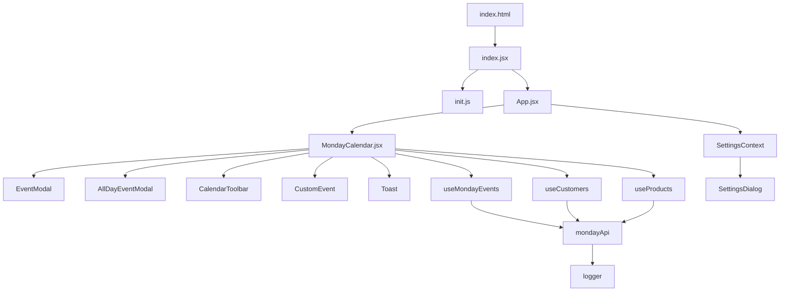

# תרשים מבנה הקוד - יומן דיווח שעות

## סקירה כללית

אפליקציית React ליצירת ולניהול יומן שעות משולב עם Monday.com, המאפשרת גרירה ושחרור של אירועים, בחירת תאריכים ושעות, וחיבור לאייטמים מלוחות Monday.

## תרשים מבנה הפרויקט



## סטטיסטיקות

- **סה"כ קבצים**: 58 קבצים
- **קבצי JavaScript/JSX**: 22 קבצים
- **קבצי CSS**: 16 קבצי module.css + 3 קבצי CSS גלובליים
- **קבצי Entry Points**: 5 קבצים
- **Hooks**: 7 hooks
- **Components**: 20+ רכיבים
- **Utils**: 3 קבצים

## Entry Points

### index.html
- **מיקום**: `/index.html`
- **מטרה**: קובץ HTML ראשי, נקודת כניסה של האפליקציה
- **תכונות**:
  - הגדרת `lang="he"` ו-`dir="rtl"` לעברית
  - div#root לרינדור React
  - script type="module" ל-`/src/index.jsx`
  - Meta tags: charset, viewport, theme-color, description
- **קשרים**: 
  - נקרא על ידי: Vite
  - טוען: `index.jsx`
- **פונקציות**: אין (קובץ HTML סטטי)
- **ממצאים**: 
  - ✅ אין ערכים קבועים בעייתיים
  - ✅ מבנה תקין

### src/index.jsx
- **מיקום**: `src/index.jsx`
- **מטרה**: נקודת כניסה של React, יוצר root ו-render את App
- **תכונות**:
  - ייבוא `init.js` (אתחול Monday SDK) - לפני כל דבר אחר
  - ייבוא `index.css` (עיצוב גלובלי)
  - יצירת React root עם `createRoot` (React 18 API)
  - render של `App` component
- **קשרים**: 
  - ייבוא: `./init`, `./index.css`, `./App`
  - נקרא על ידי: `index.html`
- **פונקציות**: אין (קוד top-level)
- **ממצאים**: 
  - ✅ מבנה תקין
  - ✅ שימוש ב-React 18 API (`createRoot`)

### src/init.js
- **מיקום**: `src/init.js`
- **מטרה**: אתחול Monday SDK - הגדרת `window.global`
- **תכונות**:
  - שורה אחת: `window.global ||= window;`
  - נדרש ל-Monday SDK (polyfill)
  - רץ לפני כל קוד אחר
- **קשרים**: 
  - ייבוא על ידי: `index.jsx` (ייבוא ראשון)
- **פונקציות**: אין (קוד top-level)
- **ממצאים**: 
  - ✅ מבנה תקין
  - ✅ שימוש ב-logical assignment operator (`||=`)

### vite.config.js
- **מיקום**: `/vite.config.js`
- **מטרה**: הגדרות Vite build tool
- **תכונות**:
  - Build output: `build/`
  - Server port: 8301 (hardcoded)
  - Allowed hosts: `.apps-tunnel.monday.app` (hardcoded)
  - React plugin
  - ES Modules
- **קשרים**: 
  - משמש את: Vite
  - תלוי ב: `@vitejs/plugin-react`
- **פונקציות**: 
  - `defineConfig()` - wrapper function
- **ממצאים**: 
  - ⚠️ Port 8301 hardcoded - לא משפיע על הטמעה
  - ⚠️ Allowed hosts hardcoded - נדרש ל-Monday tunnel
  - ✅ מבנה תקין

### package.json
- **מיקום**: `/package.json`
- **מטרה**: הגדרות הפרויקט, dependencies, scripts
- **תכונות**:
  - Dependencies: 
    - React 18.2.0
    - Monday SDK: `@mondaycom/apps-sdk` ^2.1.2, `monday-sdk-js` ^0.5.5
    - UI: `@vibe/core` ^3.77.0, `lucide-react` ^0.555.0
    - Calendar: `react-big-calendar` ^1.19.4
    - Utils: `date-fns` ^4.1.0
  - DevDependencies: Vite, React plugins, CLI tools
  - Scripts: start, build, deploy, expose, stop
  - Type: module (ES Modules)
- **קשרים**: 
  - מגדיר את כל ה-dependencies של הפרויקט
- **פונקציות**: אין (קובץ JSON)
- **ממצאים**: 
  - ✅ כל ה-dependencies נראים רלוונטיים
  - ⚠️ יש script `test` ו-`eject` שלא בשימוש (מ-react-scripts)
  - ✅ מבנה תקין

## Core Files

### src/App.jsx
- **מיקום**: `src/App.jsx`
- **מטרה**: רכיב App הראשי, מנהל את SettingsContext ו-SettingsDialog
- **תכונות**:
  - מספק `SettingsProvider` עם Monday SDK
  - מנהל state של `isSettingsOpen` ו-`context`
  - טוען context מ-Monday בעלייה
  - מציג loading state בזמן טעינת הגדרות
- **קשרים**: 
  - ייבוא: `MondayCalendar`, `SettingsProvider`, `SettingsDialog`, `logger`
  - מספק: `SettingsProvider` עם Monday SDK
- **פונקציות**:
  - `AppContent` - רכיב פנימי שמשתמש ב-Settings Context
  - `App` - רכיב עטיפה עם SettingsProvider
- **ממצאים**: 
  - ✅ מבנה תקין
  - ⚠️ `useEffect` עם dependency array ריק - תקין (טעינה חד-פעמית)
  - ✅ טיפול בשגיאות ב-try-catch

### src/MondayCalendar.jsx
- **מיקום**: `src/MondayCalendar.jsx`
- **מטרה**: רכיב הלוח הראשי, מנהל את כל הלוגיקה של היומן
- **תכונות**:
  - רכיב כבד מאוד (951 שורות)
  - משתמש ב-`react-big-calendar` עם drag-and-drop
  - מנהל state רב: modals, events, UI state
  - טוען אירועים, context, settings
  - מטפל ביצירה, עדכון, מחיקה של אירועים
- **קשרים**: 
  - ייבוא: hooks רבים (useMondayEvents, useToast, useCustomers, useBoardOwner)
  - ייבוא: components רבים (EventModal, AllDayEventModal, CalendarToolbar, CustomEvent, Toast)
  - ייבוא: utils (mondayApi, mondayColumns, logger)
  - ייבוא: constants (calendarConfig)
- **פונקציות עיקריות**:
  - `loadEventDataForEdit` - טעינת נתוני אירוע לעריכה
  - `handleEventClick` - לחיצה על אירוע קיים
  - `onSelectSlot` - לחיצה על סלוט ריק
  - `onEventDrop` - גרירת אירוע
  - `onEventResize` - שינוי אורך אירוע
  - `handleCreateEvent` - יצירת אירוע חדש
  - `handleUpdateEvent` - עדכון אירוע
  - `handleDeleteEvent` - מחיקת אירוע
  - `handleCreateAllDayEvent` - יצירת אירוע יומי
  - `handleUpdateAllDayEvent` - עדכון אירוע יומי
  - `handleDeleteAllDayEvent` - מחיקת אירוע יומי
  - `handleStartTimeChange` - עדכון שעת התחלה
  - `handleEndTimeChange` - עדכון שעת סיום
  - `handleDateChange` - עדכון תאריך
  - `handleRangeChange` - שינוי טווח תאריכים
  - `eventStyleGetter` - קביעת עיצוב אירוע
  - `CustomToolbarWithProps` - toolbar מותאם
- **ממצאים**: 
  - ⚠️ **רכיב כבד מאוד** - 951 שורות, דורש בדיקה מיוחדת ל-re-renders
  - ⚠️ **useEffect dependencies**: 
    - שורה 106: `useEffect(() => {...}, [])` - תקין (טעינה חד-פעמית)
    - שורה 121: `useEffect(() => {...}, [monday])` - תקין
    - שורה 142: `useEffect(() => {...}, [context?.boardId, customSettings?.dateColumnId, loadEvents])` - ⚠️ תלוי ב-`loadEvents` שלא מוגדר ב-dependencies
  - ⚠️ **useCallback dependencies**:
    - `onEventDrop`: `[updateEventPosition, showSuccess, showError]` - ✅ תקין
    - `onEventResize`: `[updateEventPosition, showSuccess, showError]` - ✅ תקין
    - `loadEventDataForEdit`: `[context, customSettings, monday, settings]` - ✅ תקין
    - `handleEventClick`: `[loadEventDataForEdit]` - ✅ תקין
    - `onSelectSlot`: `[monday, settings, context]` - ⚠️ לא תלוי ב-`roundToNearest30Minutes` (אבל זה constant)
    - `handleRangeChange`: `[loadEvents]` - ✅ תקין
    - `CustomToolbarWithProps`: `[onOpenSettings, monday, customSettings, columnIds, events, isOwner]` - ✅ תקין
  - ⚠️ **אין React.memo** - רכיב כבד ללא memoization
  - ⚠️ **אין useMemo** - חישובים כבדים ללא memoization
  - ⚠️ **Magic number**: `86400000` (24 שעות במילישניות) - שורה 368
  - ✅ טיפול בשגיאות בכל הפונקציות

### src/contexts/SettingsContext.jsx
- **מיקום**: `src/contexts/SettingsContext.jsx`
- **מטרה**: Context API לניהול הגדרות האפליקציה
- **תכונות**:
  - מספק `SettingsProvider` component
  - מספק `useSettings` hook
  - טוען הגדרות מ-Monday Storage
  - שומר הגדרות ב-Monday Storage
  - מגדיר `DEFAULT_SETTINGS` עם כל ההגדרות
- **קשרים**: 
  - ייבוא: `logger`
  - משמש את: כל הרכיבים שצריכים גישה להגדרות
- **פונקציות**:
  - `SettingsProvider` - Provider component
  - `loadSettings` - טעינת הגדרות מ-storage
  - `updateSettings` - עדכון ושמירת הגדרות
  - `resetSettings` - איפוס הגדרות לברירת מחדל
  - `useSettings` - custom hook לשימוש ב-Context
- **ממצאים**: 
  - ✅ מבנה תקין
  - ⚠️ `useEffect` עם dependency array ריק - תקין (טעינה חד-פעמית)
  - ⚠️ `loadSettings` לא ב-dependency array של useEffect - תקין (async function)
  - ✅ טיפול בשגיאות
  - ✅ Hardcoded values: `workDayStart: "06:00"`, `workDayEnd: "20:00"` - ברירות מחדל, לא בעייתי

## Hooks

### src/hooks/useCustomers.js
- **מטרה**: ניהול לקוחות - אחזור וסינון לקוחות לפי משתמש
- **תכונות**:
  - טוען לקוחות מהלוח החיצוני (`connectedBoardId`)
  - מסנן לפי עמודות people (`peopleColumnIds`)
  - משתמש ב-GraphQL query עם `items_page` ו-`query_params`
- **קשרים**: 
  - ייבוא: `useSettings`, `logger`, `mondaySdk`
  - משמש את: `MondayCalendar`, `EventModal`, `AllDayEventModal`
- **פונקציות**:
  - `fetchCustomers` - אחזור לקוחות עם סינון לפי משתמש
- **Return values**: `{ customers, loading, error, refetch }`
- **ממצאים**: 
  - ✅ `useCallback` עם dependencies נכונים: `[customSettings.connectedBoardId, customSettings.peopleColumnIds]`
  - ✅ `useEffect` עם dependency על `fetchCustomers` - תקין
  - ✅ טיפול בשגיאות

### src/hooks/useProducts.js
- **מטרה**: ניהול מוצרים - אחזור ויצירת מוצרים לפי לקוח
- **תכונות**:
  - אחזור מוצרים לפי לקוח דרך `productsCustomerColumnId`
  - יצירת מוצר חדש עם קישור ללקוח
  - שימוש ב-cache ל-`customerLinkColumnId`
- **קשרים**: 
  - ייבוא: `useSettings`, `logger`, `mondaySdk`
  - משמש את: `EventModal`, `ProductSelect`
- **פונקציות**:
  - `findCustomerLinkColumn` - מציאת עמודת קישור ללקוח (עם cache)
  - `fetchForCustomer` - אחזור מוצרים לפי לקוח
  - `createProduct` - יצירת מוצר חדש
- **Return values**: `{ products, loading, fetchForCustomer, createProduct }`
- **ממצאים**: 
  - ✅ `useCallback` עם dependencies נכונים
  - ⚠️ `fetchForCustomer` - dependency על `loading` ב-condition אבל לא ב-dependencies - תקין (מניעת קריאות כפולות)
  - ✅ שימוש ב-`useRef` ל-cache - חכם
  - ✅ טיפול בשגיאות

### src/hooks/useProductsMultiple.js
- **מטרה**: ניהול מוצרים מרובים - עבור מספר לקוחות במקביל
- **תכונות**:
  - ניהול state של מוצרים לכל לקוח בנפרד (`{ customerId: [products] }`)
  - ניהול loading state לכל לקוח בנפרד
  - שימוש ב-`createProduct` מ-`mondayApi`
- **קשרים**: 
  - ייבוא: `useSettings`, `logger`, `mondaySdk`, `createProduct` מ-`mondayApi`
  - משמש את: `AllDayEventModal`
- **פונקציות**:
  - `fetchForCustomer` - אחזור מוצרים לפי לקוח
  - `createProductForCustomer` - יצירת מוצר חדש ללקוח
- **Return values**: `{ products, loadingProducts, fetchForCustomer, createProduct }`
- **ממצאים**: 
  - ✅ `useCallback` עם dependencies נכונים: `[customSettings.productsCustomerColumnId]`
  - ✅ טיפול בשגיאות
  - ⚠️ כפילות עם `useProducts` - יש לוגיקה דומה

### src/hooks/useMondayEvents.js
- **מטרה**: ניהול אירועים - CRUD operations על אירועים ב-Monday
- **תכונות**:
  - Hook כבד מאוד (661 שורות)
  - מטפל בכל הפעולות CRUD על אירועים
  - האזנה לשינויים ב-filter
  - Pagination לטעינת אירועים
  - Optimistic updates עם rollback
- **קשרים**: 
  - ייבוא: `useSettings`, `logger`, `mondayApi` functions, `date-fns`
  - משמש את: `MondayCalendar`
- **פונקציות**:
  - `rulesToGraphQL` - המרת חוקים לפורמט GraphQL
  - `buildAllRules` - בניית כל החוקים (תאריכים + פילטר + חיפוש)
  - `loadEvents` - טעינת אירועים עם pagination
  - `buildColumnValues` - בניית column values ליצירה/עדכון
  - `createEvent` - יצירת אירוע חדש
  - `updateEvent` - עדכון אירוע קיים
  - `deleteEvent` - מחיקת אירוע
  - `updateEventPosition` - עדכון מיקום אירוע (גרירה/שינוי גודל)
  - `addEvent` - הוספת אירוע ל-state
- **Return values**: `{ events, loading, error, loadEvents, createEvent, updateEvent, deleteEvent, updateEventPosition, addEvent }`
- **ממצאים**: 
  - ⚠️ **Hook כבד מאוד** - 661 שורות
  - ⚠️ `loadEvents` - dependency array ארוך: `[context, customSettings, monday, currentFilter, buildAllRules, rulesToGraphQL]` - צריך לבדוק אם כל ה-dependencies נדרשים
  - ⚠️ `updateEvent` - dependency על `events` - עלול לגרום ל-re-renders מיותרים
  - ⚠️ `deleteEvent` - dependency על `events` - עלול לגרום ל-re-renders מיותרים
  - ⚠️ `updateEventPosition` - dependency על `events` - עלול לגרום ל-re-renders מיותרים
  - ✅ טיפול בשגיאות עם rollback
  - ✅ Pagination לטעינת אירועים
  - ✅ Cleanup של listeners ב-useEffect

### src/hooks/useStageOptions.js
- **מטרה**: אחזור אפשרויות שלב מ-Monday column
- **תכונות**:
  - טוען labels מעמודת status או dropdown
  - מסנן labels מושבתים (`is_deactivated`)
- **קשרים**: 
  - ייבוא: `logger`
  - משמש את: `StageSelect`, `EventModal`, `AllDayEventModal`
- **פונקציות**:
  - `fetchStageOptions` - אחזור אפשרויות שלב
- **Return values**: `{ stageOptions, loading, error }`
- **ממצאים**: 
  - ✅ `useEffect` עם dependencies נכונים: `[monday, boardId, columnId]`
  - ✅ טיפול בשגיאות
  - ✅ סינון labels מושבתים

### src/hooks/useToast.js
- **מטרה**: ניהול הודעות Toast - הצגת הודעות למשתמש
- **תכונות**:
  - Hook פשוט לניהול state של toasts
  - פונקציות עזר: `showSuccess`, `showError`, `showWarning`, `showInfo`
- **קשרים**: 
  - משמש את: `MondayCalendar`, `EventModal`, `AllDayEventModal`
- **פונקציות**:
  - `showToast` - הצגת toast כללי
  - `removeToast` - הסרת toast
  - `showSuccess`, `showError`, `showWarning`, `showInfo` - פונקציות עזר
- **Return values**: `{ toasts, showToast, showSuccess, showError, showWarning, showInfo, removeToast }`
- **ממצאים**: 
  - ✅ `useCallback` עם dependencies נכונים (אין dependencies)
  - ✅ Hook פשוט ונקי
  - ⚠️ `Date.now() + Math.random()` ל-ID - לא אידיאלי, אבל עובד

### src/hooks/useBoardOwner.js
- **מטרה**: אחזור בעל הלוח - בדיקה אם המשתמש הנוכחי הוא owner
- **תכונות**:
  - טוען owners של הלוח
  - בודק אם המשתמש הנוכחי הוא owner
- **קשרים**: 
  - ייבוא: `logger`
  - משמש את: `MondayCalendar`
- **פונקציות**:
  - `checkOwnerStatus` - בדיקת סטטוס owner
- **Return values**: `{ isOwner, loading, checkOwnerStatus }`
- **ממצאים**: 
  - ✅ `useCallback` עם dependencies נכונים: `[monday]`
  - ✅ `useEffect` עם dependency על `checkOwnerStatus` - תקין
  - ✅ טיפול בשגיאות

## Utils

### src/utils/logger.js
- **מטרה**: מערכת לוגים מותאמת אישית עם שליטה ברמת הלוגים
- **תכונות**:
  - רמות לוג: DEBUG, INFO, WARN, ERROR, NONE
  - בפרודקשן: רק ERROR
  - בפיתוח: כל הלוגים
  - לוגים מיוחדים ל-API: `api`, `apiResponse`, `apiError`
  - לוגים לפונקציות: `functionStart`, `functionEnd`
  - צבעים לקונסול
- **קשרים**: 
  - משמש את: כל הקבצים באפליקציה
- **פונקציות**:
  - `setLevel` - הגדרת רמת לוג
  - `isDebug` - בדיקה אם מצב debug פעיל
  - `debug`, `info`, `warn`, `error` - לוגים רגילים
  - `api`, `apiResponse`, `apiError` - לוגים ל-API
  - `functionStart`, `functionEnd` - לוגים לפונקציות
- **ממצאים**: 
  - ✅ מערכת לוגים מקצועית
  - ⚠️ **Security**: `console.log` פעיל - זה בסדר, זה חלק ממערכת הלוגים
  - ⚠️ **Security**: בפרודקשן מוצגות רק שגיאות - תקין
  - ✅ תיעוד מפורט

### src/utils/mondayApi.js
- **מטרה**: פונקציות עזר לעבודה עם Monday API
- **תכונות**:
  - 13 פונקציות עזר ל-Monday API
  - טיפול בשגיאות בכל הפונקציות
  - לוגים מפורטים לכל קריאה
  - Pagination ב-`fetchAllBoardItems`
- **קשרים**: 
  - ייבוא: `logger`
  - משמש את: hooks רבים, components
- **פונקציות**:
  - `parseTimeString` - המרת מחרוזת שעה ל-Date
  - `fetchColumnSettings` - אחזור הגדרות עמודה
  - `fetchAllBoardItems` - אחזור כל האייטמים (עם pagination)
  - `createBoardItem` - יצירת אייטם חדש
  - `fetchEventsFromBoard` - שליפת אירועים
  - `fetchCustomersForUser` - אחזור לקוחות למשתמש
  - `findCustomerLinkColumn` - מציאת עמודת קישור ללקוח
  - `createProduct` - יצירת מוצר חדש
  - `updateItemColumnValues` - עדכון ערכי עמודות
  - `fetchCurrentUser` - אחזור המשתמש הנוכחי
  - `fetchItemById` - אחזור אייטם בודד
  - `fetchCustomerById` - אחזור לקוח בודד
  - `deleteItem` - מחיקת אייטם
- **ממצאים**: 
  - ✅ **טיפול בשגיאות**: כל הפונקציות עם try-catch
  - ✅ **לוגים**: כל הפונקציות עם לוגים מפורטים
  - ⚠️ **Edge Cases**: 
    - `fetchAllBoardItems` - pagination עם limit 100 - תקין
    - `createBoardItem` - טיפול ב-`response.errors` - תקין
    - `findCustomerLinkColumn` - טיפול ב-parsing errors - תקין
  - ⚠️ **Complexity Budget**: 
    - `fetchAllBoardItems` - עלול להיות כבד עם הרבה אייטמים
    - `fetchEventsFromBoard` - limit 500 - תקין
  - ⚠️ **Network Disconnections**: אין retry logic - עלול להיכשל בניתוקי רשת
  - ✅ תיעוד טוב

### src/utils/mondayColumns.js
- **מטרה**: פונקציות עזר לעבודה עם עמודות Monday
- **תכונות**:
  - פרסור ערכי עמודות (Date, Hour, Board Relation)
  - המרת אייטמים לאירועים
  - בניית column values
  - בניית queries
- **קשרים**: 
  - ייבוא: `date-fns`, `logger`
  - משמש את: `MondayCalendar`, `useMondayEvents`
- **פונקציות**:
  - `getColumnIds` - קבלת מזהי עמודות מההגדרות
  - `parseDateColumn` - פרסור עמודת Date
  - `parseHourColumn` - פרסור עמודת Hour
  - `parseBoardRelationColumn` - פרסור עמודת Board Relation
  - `mapItemToEvent` - המרת אייטם לאירוע
  - `buildColumnValues` - בניית column values
  - `buildFetchEventsQuery` - בניית query לשליפת אירועים
- **ממצאים**: 
  - ✅ טיפול בשגיאות בכל הפונקציות
  - ⚠️ **Hardcoded values**: 
    - `getColumnIds` - שימוש ב-`settings.daurtion` (typo) - צריך לתקן
    - `getColumnIds` - שימוש ב-`settings.perent_item_board` (typo) - צריך לתקן
  - ✅ תיעוד טוב

## Constants

### src/constants/calendarConfig.js
- **מטרה**: הגדרות לוח שנה, פונקציות עזר לזמנים
- **תכונות**:
  - לוקליזציה עברית ל-`react-big-calendar`
  - תרגום תוויות לעברית
  - פונקציות ליצירת רשימות שעות (15 דקות, 30 דקות)
  - פונקציה לעיגול ל-30 דקות
  - פורמטים מותאמים לשעון 24 שעות
- **קשרים**: 
  - ייבוא: `date-fns`, `react-big-calendar`
  - משמש את: `MondayCalendar`, `TimeSelect`, `AllDayEventModal`
- **Exports**:
  - `localizer` - localizer ל-`react-big-calendar`
  - `hebrewMessages` - תרגום תוויות לעברית
  - `timeOptions` - רשימת שעות בקפיצות של 15 דקות
  - `timeOptions30Minutes` - רשימת שעות בקפיצות של 30 דקות
  - `durationOptions30Minutes` - רשימת משכי זמן בקפיצות של 30 דקות
  - `generateTimeOptions30Minutes` - פונקציה ליצירת רשימת שעות עם טווח
  - `roundToNearest30Minutes` - פונקציה לעיגול ל-30 דקות
  - `DEFAULT_MIN_TIME`, `DEFAULT_MAX_TIME` - ברירות מחדל לטווח שעות
  - `formats` - פורמטים מותאמים
- **ממצאים**: 
  - ✅ אין hardcoded values בעייתיים
  - ✅ כל הערכים הם constants או פונקציות
  - ✅ תיעוד טוב

## Components

### Modals

#### src/components/EventModal/EventModal.jsx
- **מטרה**: חלון ליצירת/עריכת אירוע בודד
- **תכונות**:
  - רכיב כבד (395 שורות)
  - מצבי יצירה ועריכה
  - בחירת לקוח, מוצר, שלב
  - ולידציה של טופס
  - תיבת אישור למחיקה
- **קשרים**: 
  - ייבוא: `useSettings`, `useCustomers`, `useProducts`, `useStageOptions`, `ProductSelect`, `StageSelect`, `ConfirmDialog`
  - משמש את: `MondayCalendar`
- **Props**: `isOpen`, `onClose`, `pendingSlot`, `onCreate`, `eventToEdit`, `isEditMode`, `onUpdate`, `onDelete`, `selectedItem`, `setSelectedItem`, `monday`
- **State**: `selectedItem`, `notes`, `selectedProduct`, `selectedStage`, `isCreatingProduct`, `selectedItemProducts`, `showDeleteConfirm`, `boardId`
- **פונקציות עיקריות**:
  - `handleCreateProduct` - יצירת מוצר חדש
  - `handleCreate` - יצירה/עדכון אירוע
  - `isFormValid` - ולידציה של טופס
  - `handleKeyDown` - טיפול ב-Enter key
- **ממצאים**: 
  - ⚠️ **useEffect dependencies**: 
    - שורה 116: dependency array ארוך - `[isOpen, isEditMode, eventToEdit, localCustomers, setSelectedItem, customSettings.productsCustomerColumnId, fetchForCustomer]`
    - שורה 133: dependency array - `[selectedItem, isCreatingProduct, customSettings.productsCustomerColumnId, fetchForCustomer, isEditMode]`
  - ⚠️ **Prop drilling**: מקבל הרבה props מ-`MondayCalendar`
  - ✅ טיפול בשגיאות

#### src/components/AllDayEventModal/AllDayEventModal.jsx
- **מטרה**: חלון ליצירת/עריכת מספר אירועים (דיווחים מרובים או אירועים יומיים)
- **תכונות**:
  - רכיב כבד מאוד (955 שורות)
  - תמיכה ב-4 סוגי אירועים: מחלה, חופשה, מילואים, דיווחים מרובים
  - ניהול מספר דיווחים במקביל
  - Smart Cascade - פתרון חפיפות אוטומטי
  - חישובי זמן מורכבים
- **קשרים**: 
  - ייבוא: `useSettings`, `useCustomers`, `useProductsMultiple`, `useStageOptions`, `ProductSelect`, `StageSelect`, `TimeSelect`, `ConfirmDialog`
  - משמש את: `MondayCalendar`
- **Props**: `isOpen`, `onClose`, `pendingDate`, `onCreate`, `eventToEdit`, `isEditMode`, `onUpdate`, `onDelete`, `monday`
- **State**: `selectedType`, `viewMode`, `searchTerm`, `addedReports`, `selectedProducts`, `selectedStages`, `isCreatingProduct`, `showCloseConfirm`, `showDeleteConfirm`, `editingDuration`, `boardId`
- **פונקציות עיקריות**:
  - `addReportRow` - הוספת שורת דיווח
  - `removeReportRow` - הסרת שורת דיווח
  - `updateReport` - עדכון דיווח (עם Smart Cascade)
  - `resolveOverlaps` - פתרון חפיפות אוטומטי
  - `calculateHoursFromTimeRange` - חישוב שעות מטווח זמן
  - `hasValidReports` - בדיקת ולידציה
- **ממצאים**: 
  - ⚠️ **רכיב כבד מאוד** - 955 שורות, דורש בדיקה מיוחדת
  - ⚠️ **useMemo**: שורה 31 - `timeOptions` עם `useMemo` - ✅ תקין
  - ⚠️ **useEffect dependencies**: 
    - שורה 141: dependency array - `[isOpen, isEditMode, eventToEdit, refetchCustomers]`
    - שורה 149: dependency array - `[productsByCustomer]`
  - ⚠️ **לוגיקה מורכבת**: Smart Cascade, חישובי זמן - עלול להיות קשה לתחזוקה
  - ✅ טיפול בשגיאות

#### src/components/SettingsDialog/SettingsDialog.jsx
- **מטרה**: חלון הגדרות האפליקציה
- **תכונות**:
  - רכיב כבד מאוד (928 שורות)
  - ניהול הגדרות מורכבות
  - טעינת לוחות, עמודות, הגדרות
  - ולידציה של הגדרות
  - טאבים וסקציות
- **קשרים**: 
  - ייבוא: `useSettings`, `SearchableSelect`, `MultiSelect`, `SettingsAccordion`, `SettingsSection`, `SettingsTabs`, `useSettingsValidation`
  - משמש את: `App`
- **Props**: `monday`, `onClose`, `context`
- **State**: הרבה state - לוחות, עמודות, הגדרות
- **פונקציות עיקריות**:
  - `fetchBoards` - שליפת רשימת לוחות
  - `fetchPeopleColumns` - שליפת עמודות people
  - `fetchCustomerProductsColumns` - שליפת עמודות מוצרים
  - `extractProductBoardsFromColumn` - חילוץ לוחות מוצרים
  - `fetchCurrentBoardColumns` - שליפת עמודות מהלוח הנוכחי
  - `handleSave` - שמירת הגדרות
- **ממצאים**: 
  - ⚠️ **רכיב כבד מאוד** - 928 שורות
  - ⚠️ **useEffect**: שורה 80 - dependency array ריק - תקין (טעינה חד-פעמית)
  - ⚠️ **State רב**: הרבה state variables - עלול להיות קשה לתחזוקה
  - ✅ טיפול בשגיאות

#### src/components/ConfirmDialog/ConfirmDialog.jsx
- **מטרה**: חלון אישור כללי
- **תכונות**:
  - רכיב פשוט (48 שורות)
  - תמיכה ב-primary ו-danger styles
  - props גמישים
- **קשרים**: 
  - משמש את: `EventModal`, `AllDayEventModal`
- **Props**: `isOpen`, `onClose`, `onConfirm`, `onCancel`, `title`, `message`, `confirmText`, `cancelText`, `confirmButtonStyle`
- **ממצאים**: 
  - ✅ רכיב פשוט ונקי
  - ✅ אין state פנימי
  - ✅ אין useEffect

### Selects

#### src/components/ProductSelect/ProductSelect.jsx
- **מטרה**: רכיב Dropdown למוצרים עם אפשרות להוסיף מוצר חדש
- **תכונות**:
  - Dropdown עם חישוב מיקום אוטומטי
  - אפשרות ליצירת מוצר חדש
  - טיפול ב-click outside
  - עדכון מיקום בעת scroll/resize
- **קשרים**: 
  - משמש את: `EventModal`, `AllDayEventModal`
- **Props**: `products`, `selectedProduct`, `onSelectProduct`, `onCreateNew`, `isLoading`, `disabled`, `isCreatingProduct`
- **State**: `isOpen`, `isCreating`, `newProductName`, `dropdownPosition`
- **פונקציות עיקריות**:
  - `calculateDropdownPosition` - חישוב מיקום dropdown
  - `handleSelect` - בחירת מוצר
  - `handleCreateClick` - יצירת מוצר חדש
- **ממצאים**: 
  - ✅ Cleanup של event listeners ב-useEffect
  - ⚠️ **כפילות**: לוגיקה דומה ל-`StageSelect` ו-`TimeSelect` - אפשר לאחד

#### src/components/StageSelect/StageSelect.jsx
- **מטרה**: רכיב Dropdown לשלבים
- **תכונות**:
  - Dropdown עם חישוב מיקום אוטומטי
  - טיפול ב-click outside
  - עדכון מיקום בעת scroll/resize
- **קשרים**: 
  - משמש את: `EventModal`, `AllDayEventModal`
- **Props**: `stages`, `selectedStage`, `onSelectStage`, `isLoading`, `disabled`
- **State**: `isOpen`, `dropdownPosition`
- **פונקציות עיקריות**:
  - `calculateDropdownPosition` - חישוב מיקום dropdown
  - `handleSelect` - בחירת שלב
- **ממצאים**: 
  - ✅ Cleanup של event listeners ב-useEffect
  - ⚠️ **כפילות**: לוגיקה דומה ל-`ProductSelect` ו-`TimeSelect` - אפשר לאחד

#### src/components/TimeSelect/TimeSelect.jsx
- **מטרה**: רכיב Dropdown לזמנים עם אפשרות הקלדה
- **תכונות**:
  - Dropdown עם חישוב מיקום אוטומטי
  - אפשרות הקלדה ישירה
  - עיגול אוטומטי ל-30 דקות
  - מעבר אוטומטי לשדה דקות אחרי הקלדת שעות
  - גלילה אוטומטית לפריט שנבחר
- **קשרים**: 
  - משמש את: `AllDayEventModal`
- **Props**: `times`, `selectedTime`, `onSelectTime`, `isLoading`, `disabled`, `placeholder`
- **State**: `isOpen`, `dropdownPosition`, `inputValue`
- **פונקציות עיקריות**:
  - `calculateDropdownPosition` - חישוב מיקום dropdown
  - `validateAndRoundTime` - ולידציה ועגול ל-30 דקות
  - `handleSelect` - בחירת זמן
  - `handleInputChange` - טיפול בהקלדה
- **ממצאים**: 
  - ✅ Cleanup של event listeners ב-useEffect
  - ✅ לוגיקה מורכבת - ולידציה, עיגול, מעבר אוטומטי
  - ⚠️ **כפילות**: לוגיקה דומה ל-`ProductSelect` ו-`StageSelect` - אפשר לאחד

#### src/components/CustomDatePicker.jsx
- **מטרה**: בורר תאריכים מותאם אישית
- **תכונות**:
  - תצוגה חודשית
  - ניווט בין חודשים
  - סימון תאריך נבחר והיום
  - תמיכה בעברית (RTL)
- **קשרים**: 
  - ייבוא: `date-fns`
  - משמש את: `AllDayEventModal`
- **Props**: `selectedDate`, `onDateSelect`, `onClose`
- **State**: `currentMonth`
- **פונקציות עיקריות**:
  - `handleDateClick` - בחירת תאריך
  - `handlePrevMonth`, `handleNextMonth` - ניווט חודשים
- **ממצאים**: 
  - ✅ רכיב פשוט ונקי
  - ⚠️ **Inline styles**: שימוש ב-inline styles במקום CSS modules
  - ✅ שימוש ב-`date-fns` - טוב

### UI Components

#### src/components/CalendarToolbar.jsx
- **מטרה**: סרגל כלים מותאם אישית ללוח השנה
- **תכונות**:
  - כפתורי תצוגה (חודש/שבוע/יום)
  - כפתורי ניווט (קודם/הבא/היום)
  - כפתור הגדרות (רק ל-owners)
  - כותרת תאריך
- **קשרים**: 
  - ייבוא: `react-big-calendar`, `@vibe/core`, `@vibe/icons`, `useSettings`
  - משמש את: `MondayCalendar` (כ-toolbar component)
- **Props**: `onNavigate`, `onView`, `label`, `view`, `views`, `localizer`, `onOpenSettings`, `monday`, `customSettings`, `columnIds`, `events`, `isOwner`
- **ממצאים**: 
  - ✅ רכיב פשוט ונקי
  - ⚠️ **Prop drilling**: מקבל הרבה props מ-`MondayCalendar`
  - ⚠️ **Hardcoded messages**: `messages` object מוגדר בקובץ
  - ✅ אין state פנימי

#### src/components/CustomEvent/CustomEvent.jsx
- **מטרה**: רכיב מותאם אישית להצגת אירוע בלוח השנה
- **תכונות**:
  - תמיכה באירועים יומיים
  - הצגת כותרת והערות
  - עיצוב מותאם לפי צבע סטטוס
- **קשרים**: 
  - משמש את: `MondayCalendar` (כ-event component)
- **Props**: `event`
- **ממצאים**: 
  - ✅ רכיב פשוט ונקי
  - ✅ אין state פנימי
  - ✅ אין useEffect
  - ⚠️ **Hardcoded strings**: `'מחלה'`, `'חופשה'`, `'מילואים'` - צריך להיות constant

#### src/components/Toast/Toast.jsx
- **מטרה**: רכיב להצגת הודעות Toast
- **תכונות**:
  - תמיכה ב-4 סוגי הודעות: success, error, warning, info
  - סגירה אוטומטית אחרי duration
  - אנימציות
  - ToastContainer לניהול מספר הודעות
- **קשרים**: 
  - משמש את: `MondayCalendar`
- **Props**: `message`, `type`, `duration`, `onClose`
- **State**: `isVisible`
- **פונקציות עיקריות**:
  - `Toast` - רכיב הודעת toast בודדת
  - `ToastContainer` - container לניהול מספר הודעות
- **ממצאים**: 
  - ✅ רכיב פשוט ונקי
  - ✅ Cleanup של timer ב-useEffect
  - ✅ טיפול ב-animations
  - ⚠️ **Hardcoded icons**: icons מוגדרים כ-strings - יכול להיות constant

### Settings Dialog Sub-components

#### src/components/SettingsDialog/SearchableSelect.jsx
- **מטרה**: רכיב select עם חיפוש
- **תכונות**:
  - Dropdown עם חיפוש
  - חישוב מיקום אוטומטי
  - טיפול ב-click outside
  - עדכון מיקום בעת scroll/resize
- **קשרים**: 
  - משמש את: `SettingsDialog`
- **Props**: `options`, `value`, `onChange`, `placeholder`, `isLoading`, `disabled`, `showSearch`
- **State**: `isOpen`, `searchTerm`, `dropdownPosition`
- **ממצאים**: 
  - ✅ Cleanup של event listeners ב-useEffect
  - ⚠️ **כפילות**: לוגיקה דומה ל-`MultiSelect` - אפשר לאחד

#### src/components/SettingsDialog/MultiSelect.jsx
- **מטרה**: רכיב select עם בחירה מרובה
- **תכונות**:
  - Dropdown עם חיפוש ובחירה מרובה
  - חישוב מיקום אוטומטי
  - טיפול ב-click outside
  - עדכון מיקום בעת scroll/resize
- **קשרים**: 
  - משמש את: `SettingsDialog`
- **Props**: `options`, `value`, `onChange`, `placeholder`, `isLoading`, `disabled`
- **State**: `isOpen`, `searchTerm`, `dropdownPosition`
- **ממצאים**: 
  - ✅ Cleanup של event listeners ב-useEffect
  - ⚠️ **כפילות**: לוגיקה דומה ל-`SearchableSelect` - אפשר לאחד

#### src/components/SettingsDialog/SettingsTabs.jsx
- **מטרה**: רכיב טאבים להגדרות
- **תכונות**:
  - תמיכה ב-2 טאבים: "הגדרות מידע", "הגדרות יומן"
  - ניהול active tab
- **קשרים**: 
  - משמש את: `SettingsDialog`
- **Props**: `children`, `defaultTab`
- **State**: `activeTab`
- **ממצאים**: 
  - ✅ רכיב פשוט ונקי
  - ⚠️ **Hardcoded tabs**: tabs מוגדרים בקוד - לא גמיש

#### src/components/SettingsDialog/SettingsSection.jsx
- **מטרה**: רכיב סקציה בהגדרות
- **תכונות**:
  - סקציה עם כותרת ותוכן
  - תמיכה ב-toggle (פתיחה/סגירה)
  - אינדיקטור השלמה
- **קשרים**: 
  - משמש את: `SettingsDialog` (דרך `SettingsAccordion`)
- **Props**: `id`, `title`, `isOpen`, `onToggle`, `children`, `isComplete`, `description`
- **ממצאים**: 
  - ✅ רכיב פשוט ונקי
  - ✅ אין state פנימי

#### src/components/SettingsDialog/SettingsAccordion.jsx
- **מטרה**: רכיב אקורדיון לניהול מספר סקציות
- **תכונות**:
  - ניהול state של סקציות פתוחות
  - תמיכה ב-defaultOpen
- **קשרים**: 
  - משמש את: `SettingsDialog`
- **Props**: `children`, `defaultOpen`
- **State**: `openSections` (Set)
- **ממצאים**: 
  - ✅ רכיב פשוט ונקי
  - ✅ שימוש ב-Set ל-state - טוב

#### src/components/SettingsDialog/useSettingsValidation.js
- **מטרה**: Hook ל-validation של הגדרות
- **תכונות**:
  - ולידציה מקיפה של כל ההגדרות
  - בדיקת תלויות בין שדות
  - הודעות שגיאה בעברית
- **קשרים**: 
  - משמש את: `SettingsDialog`
- **Parameters**: `settings`, `context`
- **Return values**: `{ errors, isValid, getFieldError }`
- **ממצאים**: 
  - ✅ שימוש ב-`useMemo` - טוב
  - ✅ ולידציה מקיפה
  - ✅ תיעוד טוב

## CSS Files

### Global CSS

#### src/index.css
- **מטרה**: עיצוב גלובלי בסיסי
- **תכונות**:
  - הגדרת font-family
  - font-smoothing
  - עיצוב code elements
- **שימוש**: מיובא ב-`index.jsx`
- **ממצאים**: 
  - ✅ קובץ בסיסי ונקי
  - ✅ אין classes לא בשימוש

#### src/App.css
- **מטרה**: עיצוב ל-App component
- **תכונות**:
  - עיצוב `.App` container
  - עיצוב header (לא בשימוש כרגע)
  - עיצוב settings dialog
  - עיצוב main content
- **שימוש**: מיובא ב-`App.jsx`
- **ממצאים**: 
  - ⚠️ **Classes לא בשימוש**: `.app-header`, `.header-container`, `.header-container h1`, `.header-actions` - לא בשימוש (header הוסר)
  - ✅ שאר ה-classes בשימוש

#### src/calendar-custom.css
- **מטרה**: עיצוב מותאם ללוח השנה (react-big-calendar)
- **תכונות**:
  - RTL support
  - z-index fixes
  - toolbar styling
- **שימוש**: מיובא ב-`MondayCalendar.jsx`
- **ממצאים**: 
  - ✅ עיצוב מותאם ל-RTL
  - ⚠️ **Hardcoded z-index values**: `10002`, `10003` - עלול להיות בעייתי
  - ✅ תיקונים ל-react-big-calendar

### Module CSS (16 קבצים)

#### Component CSS Modules
- `EventModal.module.css` - עיצוב ל-EventModal
- `AllDayEventModal.module.css` - עיצוב ל-AllDayEventModal (529 שורות - כבד)
- `SettingsDialog.module.css` - עיצוב ל-SettingsDialog
- `ConfirmDialog.module.css` - עיצוב ל-ConfirmDialog
- `ProductSelect.module.css` - עיצוב ל-ProductSelect
- `StageSelect.module.css` - עיצוב ל-StageSelect
- `TimeSelect.module.css` - עיצוב ל-TimeSelect
- `CustomEvent.module.css` - עיצוב ל-CustomEvent
- `Toast.module.css` - עיצוב ל-Toast
- `SearchableSelect.module.css` - עיצוב ל-SearchableSelect
- `SettingsTabs.module.css` - עיצוב ל-SettingsTabs
- `SettingsSection.module.css` - עיצוב ל-SettingsSection
- `SettingsAccordion.module.css` - עיצוב ל-SettingsAccordion

**ממצאים כללים**:
- ✅ כל רכיב עם CSS module משלו - טוב
- ⚠️ **קובץ כבד**: `AllDayEventModal.module.css` - 529 שורות
- ⚠️ **בדיקה נדרשת**: צריך לבדוק אם יש classes/styles לא בשימוש בכל הקבצים

## מפת תלויות

### Entry Points
- `index.html` → `index.jsx` → `App.jsx` → `MondayCalendar.jsx`

### Data Flow
```
Monday SDK → SettingsContext → MondayCalendar
                ↓
         AllDayEventModal / EventModal
                ↓
         useCustomers / useProducts / useMondayEvents
                ↓
         mondayApi → Monday API
```

### Component Hierarchy
```
App
├── SettingsProvider
│   └── AppContent
│       ├── MondayCalendar
│       │   ├── CalendarToolbar
│       │   ├── CustomEvent
│       │   ├── EventModal
│       │   │   ├── ProductSelect
│       │   │   ├── StageSelect
│       │   │   └── ConfirmDialog
│       │   ├── AllDayEventModal
│       │   │   ├── ProductSelect
│       │   │   ├── StageSelect
│       │   │   ├── TimeSelect
│       │   │   └── ConfirmDialog
│       │   └── ToastContainer
│       └── SettingsDialog
│           ├── SearchableSelect
│           ├── MultiSelect
│           ├── SettingsTabs
│           ├── SettingsAccordion
│           │   └── SettingsSection
│           └── useSettingsValidation
```

### Imports/Exports Summary
- **סה"כ קבצים עם imports**: 31 קבצים
- **סה"כ imports**: 124+ imports
- **סה"כ exports**: 29 קבצים עם exports

### Circular Dependencies
- **לא נמצאו**: אין circular dependencies זוהו

---

*מסמך זה עודכן כחלק מסקירת קוד מקיפה*

